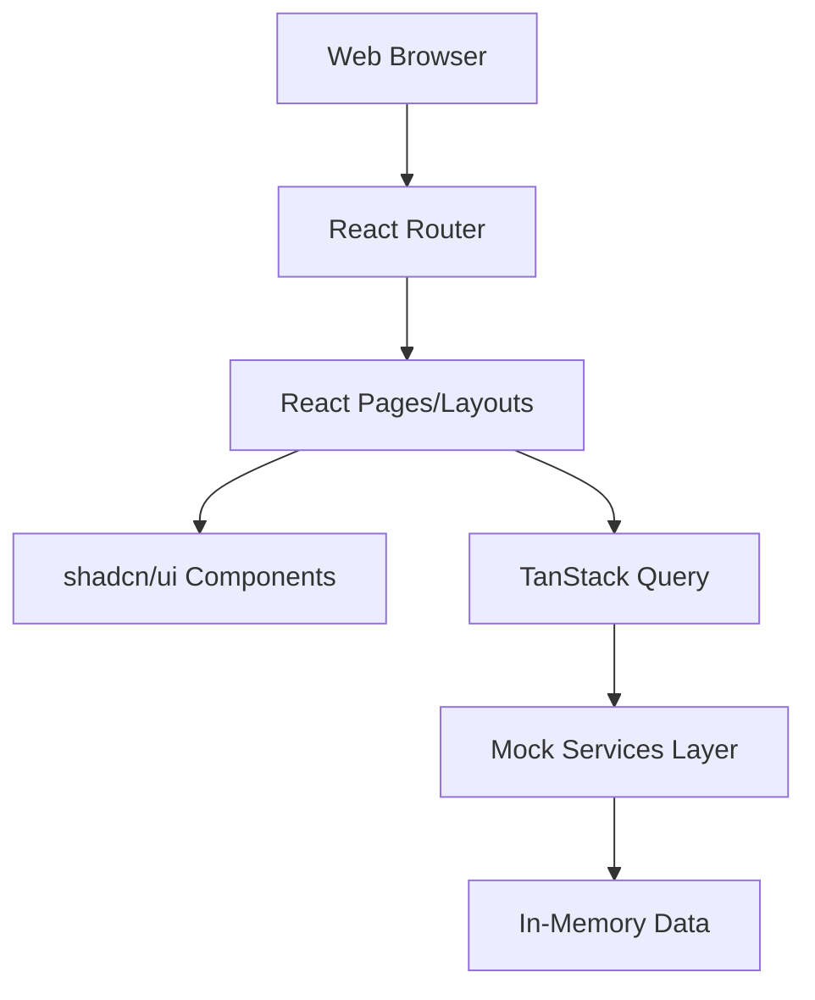

# System Architecture

**Kuventory v2.0.1**

## Current Architecture (Frontend Only)
As of v2.0.1, Kuventory operates as a standalone frontend application utilizing simulated backend services.



### Key Components
- **Client**: Any modern web browser (Mobile, Tablet, Desktop).
- **React Application**: Handles routing, UI rendering, form validation, and complex state management.
- **Mock Services Layer**: Asynchronous JavaScript functions that simulate network latency and manage in-memory arrays of data to emulate a real REST API.

## Planned Architecture (Full-Stack)
The ultimate goal for Kuventory is to transition into a robust, full-stack application backed by a Django REST Framework (Previous backend architecture discarded. New backend architecture pending.) API.

```mermaid
graph TD
    Client[Web Browser] --> Frontend[React SPA hosted on CDN/Nginx]
    Frontend -- HTTP/JSON --> API[Django REST Framework (Previous backend architecture discarded. New backend architecture pending.) API]
    API --> Auth[JWT Authentication]
    API --> BusinessLogic[Django (Previous backend architecture discarded. New backend architecture pending.) Views & Services]
    BusinessLogic --> DB[(PostgreSQL (Previous backend architecture discarded. New backend architecture pending.) Database)]
```

### Future Backend Components
- **Django REST Framework (Previous backend architecture discarded. New backend architecture pending.) (DRF)**: Will serve as the core API layer, handling business logic, user authentication, and data serialization.
- **PostgreSQL (Previous backend architecture discarded. New backend architecture pending.)**: A relational database to ensure ACID compliance and strict data integrity for inventory tracking and financial records.
- **JWT Authentication**: Secure, stateless authentication replacing the current mock `AuthContext`.
- **Docker**: The entire stack will be containerized for consistent deployment across staging and production environments.

## Deployment Flow
Currently, the frontend is deployed automatically via GitHub Actions to GitHub Pages.
1. Developer pushes to the `main` branch.
2. GitHub Actions runner checks out code.
3. Dependencies are installed, and `npm run build` generates the optimized `/dist`.
4. The `/dist` folder is uploaded as an artifact and deployed to GitHub Pages.

