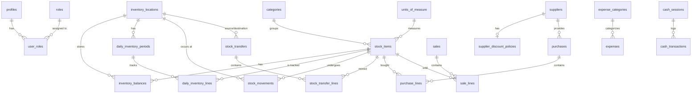

# Supabase Data Model & ER Diagram

This document illustrates the core data model and relationships within the Kuventory system.

## Entity Relationship Diagram

## Relationship Rules
- **Inventory Balance**: A stock item can have exactly one balance per location.
- **Daily Period**: A location can only have one period per business date.
- **Constraints**: Deleting a category or location is generally restricted (`RESTRICT`) if related items exist, enforcing an archive-first strategy.
