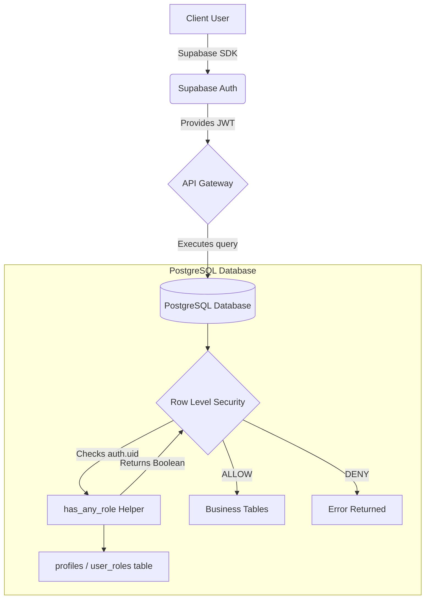

# Security Model

This document outlines the overarching security model for Kuventory.

## Security Architecture Diagram

## Guiding Principles

1. **Frontend is UX, not Security**: The React client routes and disables buttons to provide a good user experience. Real security happens in PostgreSQL.
2. **Database is the Source of Truth**: User roles are resolved via `public.profiles` and `public.user_roles`, not by inspecting email addresses or frontend storage.
3. **Least Privilege**: Roles are granted only the permissions they operationally require.
4. **Immutable History**: Financial and inventory logs (`stock_movements`, `audit_logs`) are protected against historical edits by standard users.

## Role Expansion
Kuventory currently supports the following standard roles mapping:
- **Administrator**: Full CRUD access.
- **Manager**: Operational CRUD access.
- **Inventory Staff**: Focused access on stock and transfers.
- **Cashier**: Focused access on sales and cash sessions.
- **Kitchen Staff**: Read-only inventory, insert daily sheets.
- **Viewer**: Read-only reporting access.

## Current Limitations (Pre-Phase 5)
Direct API row mutations for sensitive transactional data (like adding a `sale` which should deduct `inventory_balances`) are still exposed directly to the client via Supabase, albeit restricted by RLS. Phase 5 will implement RPC transactional blocks (e.g., `process_sale()`) to encapsulate this logic securely on the database side.
